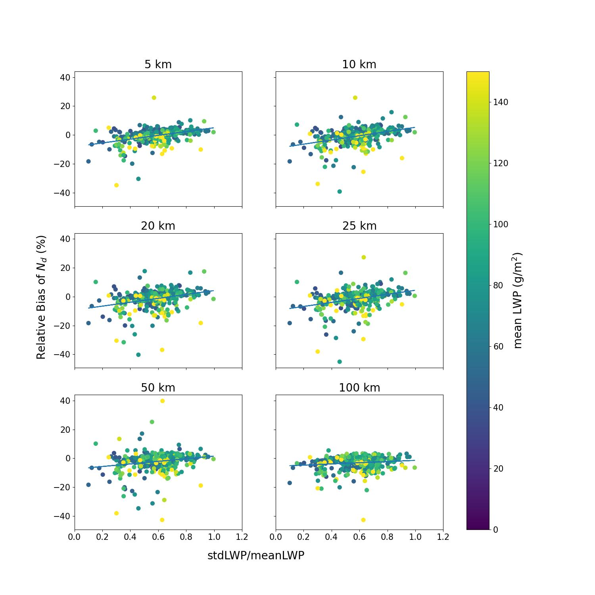

# MODIS-Nd-Bias: Satellite Cloud Droplet Analysis

A Python-based tool for analyzing biases in Cloud Droplet Number Concentration ($N_d$) from MODIS satellite data. 

## Features

-   **Robust Data Processing**: Filters and processes MODIS HDF4 Level 2 cloud products.
-   **Physics-Based Derivation**: Calculates $N_d$ using adiabatic assumptions and observation-specific lapse rates.
-   **Aggregated Statistics**: Computes regional means and biases across multiple spatial resolutions (1km to 100km).
-   **Dual Interface**: Use as a standalone Command Line Interface (CLI) or import as a library for Jupyter Notebooks.

## Installation

Install from the project directory:

```bash
pip install -e project-01-modis-nd-bias[cli,plot]
```

## Usage

### 1. Command Line Interface (CLI)
You can run the script directly from the terminal to process an entire directory of HDF files.

```bash
python -m modis_nd_bias.cli --recursive --plots
```

## Development Install

```bash
pip install -e project-01-modis-nd-bias[cli,plot]
```

## Example Script

```bash
python3 project-01-modis-nd-bias/examples/run_bias_example.py
```

**Arguments:**
-   `--input-dir`: Path to directory containing MODIS `.hdf` files.
-   `--input-dirs`: One or more input directories.
-   `--output-dir`: Output directory for processed `.nc` files and plots. Defaults to `project-01-modis-nd-bias/data/processed`.
-   `--recursive`: Search for files recursively in subdirectories.
-   `--plots`: Generate plots in the output directory.
-   `--plots-only`: Only generate plots from existing processed `.nc` files.

### 2. Jupyter Notebook / Library
For interactive analysis, import the module in your Python scripts or Notebooks. See `project-01-modis-nd-bias/notebooks/modis_nd_bias.ipynb` for a complete example.

```python
from modis_nd_bias import process_files

# Define paths and run
files = ["file1.hdf", "file2.hdf"]
process_files(files, "./output_dir", resolutions=[1, 5, 20])
```

## Repository Layout
-   `project-01-modis-nd-bias/src/modis_nd_bias/`: Python package.
-   `project-01-modis-nd-bias/examples/run_bias_example.py`: Example script (hypothetical local file).
-   `project-01-modis-nd-bias/notebooks/modis_nd_bias.ipynb`: Demonstration notebook.
-   `project-01-modis-nd-bias/notebooks/escience2020-group8-Presvelou.ipynb`: Course notebook.
-   `project-01-modis-nd-bias/data/processed/`: Processed NetCDF files and generated plots.

## Example Plot



---
*Based on the eScience Tools in Climate Science winter course (2020).*
